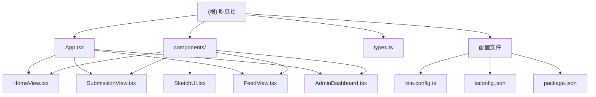

# 吃瓜社 (GossipSketch)

> **扫描时间**: 2026-01-22T13:04:48+0800
> **架构师版本**: v1.0 (自适应初始化)

---

## 变更记录 (Changelog)

### 2026-01-22
- **[新建]** 初始化项目文档结构
- **[扫描]** 完成全仓扫描，识别到核心模块与组件
- **[覆盖率]** 已扫描 17/17 文件 (100%)

---

## 项目愿景

吃瓜社是一个**手绘风格的匿名社交应用**，为用户提供一个轻松、有趣的平台来分享和浏览匿名八卦内容。应用采用手绘涂鸦美学设计，强调纯粹的吃瓜体验，支持内容提交、信息流浏览和管理员后台功能。

**核心特性**：
- 匿名内容投稿
- 热门内容排行
- 实时信息流浏览
- 管理员审核仪表板
- 手绘涂鸦风格 UI

---

## 架构总览

### 技术栈

| 层级 | 技术 | 版本 | 用途 |
|------|------|------|------|
| **前端框架** | React | 19.2.3 | UI 组件库 |
| **开发语言** | TypeScript | 5.8.2 | 类型安全 |
| **构建工具** | Vite | 6.2.0 | 开发服务器与打包 |
| **样式方案** | TailwindCSS | 3.x (CDN) | 原子化 CSS |
| **图表库** | Recharts | 3.7.0 | 数据可视化 |
| **图标库** | Lucide React + Material Symbols | 0.562.0 | 图标组件 |
| **字体** | Zhi Mang Xing / Patrick Hand / Ma Shan Zheng | - | 手写风格字体 |
| **API 服务** | Gemini API | - | AI 能力集成（潜在） |

### 项目结构

```
D:\common\Cursorwork\吃瓜\
├── components/           # UI 组件模块
│   ├── AdminDashboard.tsx
│   ├── FeedView.tsx
│   ├── HomeView.tsx
│   ├── SketchUI.tsx
│   └── SubmissionView.tsx
├── App.tsx              # 主应用组件
├── index.tsx            # 应用入口
├── types.ts             # TypeScript 类型定义
├── index.html           # HTML 模板
├── vite.config.ts       # Vite 配置
├── tsconfig.json        # TypeScript 配置
├── package.json         # 依赖管理
├── .gitignore           # Git 忽略规则
├── .env.local           # 环境变量
├── metadata.json        # 项目元数据
└── README.md            # 项目说明
```

---

## 模块结构图



---

## 模块索引

| 模块路径 | 职责 | 语言 | 入口文件 | 测试 | 备注 |
|----------|------|------|----------|------|------|
| `components/` | UI 组件集合 | TypeScript/TSX | SketchUI.tsx | ❌ 无 | 包含5个核心视图组件 |
| _(根目录)_ | 应用核心 | TypeScript | index.tsx | ❌ 无 | 包含路由与类型定义 |

---

## 运行与开发

### 前置要求
- **Node.js**: 建议 18.x 或更高版本
- **包管理器**: npm / yarn / pnpm

### 安装依赖
```bash
npm install
```

### 环境配置
在项目根目录创建 `.env.local` 文件：
```bash
GEMINI_API_KEY=your_gemini_api_key_here
```

### 开发模式
```bash
npm run dev
```
应用将在 `http://localhost:3000` 启动。

### 生产构建
```bash
npm run build
```
构建产物输出到 `dist/` 目录。

### 预览构建
```bash
npm run preview
```

---

## 测试策略

⚠️ **当前状态**: 项目暂无测试覆盖

**建议的测试策略**：
1. **单元测试**: 为 SketchUI 组件库编写测试（推荐 Vitest + React Testing Library）
2. **集成测试**: 测试组件间交互（View 切换、状态管理）
3. **E2E 测试**: 使用 Playwright 或 Cypress 覆盖核心用户流程
4. **视觉回归测试**: 使用 Chromatic 或 Percy 确保手绘风格一致性

**推荐测试框架**：
```json
{
  "vitest": "^1.0.0",
  "@testing-library/react": "^14.0.0",
  "@testing-library/user-event": "^14.0.0"
}
```

---

## 编码规范

### TypeScript 规范
- ✅ 严格模式启用 (`strict` 未明确启用，但使用 TypeScript 5.8)
- ✅ 使用 `interface` 定义数据模型（见 `types.ts`）
- ✅ 组件使用 `React.FC<Props>` 类型注解
- ✅ 避免 `any` 类型

### 样式规范
- 🎨 使用 TailwindCSS 原子类
- 🎨 自定义颜色系统：`paper`、`ink`、`highlight`、`alert`
- 🎨 手绘风格边框：使用 `doodle-border` 和 `roughBorderClass` 工具类
- 🎨 阴影系统：`shadow-sketch`、`shadow-sketch-lg`、`shadow-sketch-hover`

### 组件规范
- 📦 功能组件优先（Functional Components）
- 📦 使用 Hooks 管理状态（`useState`）
- 📦 单一职责原则：每个组件专注一个功能
- 📦 可复用组件放在 `components/SketchUI.tsx`

### 命名规范
- 文件名：PascalCase（如 `HomeView.tsx`）
- 组件名：PascalCase（如 `SketchButton`）
- 类型名：PascalCase（如 `ViewType`、`Post`）
- 函数名：camelCase（如 `handleNext`）

---

## AI 使用指引

### 上下文提供
当向 AI 助手请求帮助时，请提供：
1. **当前视图/组件名称**（如"正在修改 HomeView.tsx"）
2. **预期功能**（如"希望添加点赞动画效果"）
3. **相关代码片段**（如当前组件的关键部分）

### 常见任务提示词

#### 新增视图组件
```
请创建一个新的视图组件 [ComponentName]，参考 HomeView.tsx 的结构，
包含手绘风格卡片和 Sketch 风格按钮，主要功能是 [描述功能]。
```

#### 修改样式
```
请调整 [ComponentName] 的样式，使其符合手绘风格设计规范，
参考 SketchUI.tsx 中的 roughBorderClass 和 shadow-sketch 系统。
```

#### 添加数据可视化
```
请使用 Recharts 库为 AdminDashboard 添加 [图表类型]，
展示 [数据描述]，样式需符合黑白手绘风格（黑色描边、白色填充）。
```

#### 类型定义
```
请在 types.ts 中添加新的类型定义 [TypeName]，包含字段：[字段列表]，
并确保与现有 Post、Report 类型风格一致。
```

### 风格指南
- **视觉风格**: 手绘涂鸦、不规则边框、黑白为主色调、高亮黄色点缀
- **交互风格**: 轻量动画、hover 效果、sketch 阴影变化
- **语气**: 轻松幽默、中文本地化、年轻化表达

---

## 关键文件清单

### 核心应用文件
- **App.tsx**: 主应用组件，包含路由逻辑与导航栏
- **index.tsx**: React 应用入口
- **types.ts**: 全局类型定义（ViewType、Post、Report、ChartDataPoint）
- **index.html**: HTML 模板，包含 TailwindCSS CDN 与字体引入

### 组件模块
- **HomeView.tsx**: 最新吃瓜内容卡片视图
- **SubmissionView.tsx**: 匿名投稿表单视图
- **FeedView.tsx**: 热门内容列表视图
- **AdminDashboard.tsx**: 管理员审核后台
- **SketchUI.tsx**: 手绘风格 UI 组件库（Button、Card、Badge、Tape）

### 配置文件
- **vite.config.ts**: Vite 构建配置，包含环境变量注入
- **tsconfig.json**: TypeScript 编译配置
- **package.json**: 项目依赖与脚本
- **.gitignore**: Git 忽略规则
- **.env.local**: 环境变量（包含 GEMINI_API_KEY）

---

## 已知问题与改进建议

### 当前缺失
1. ❌ **无测试覆盖**: 建议添加 Vitest + React Testing Library
2. ❌ **无代码质量工具**: 建议添加 ESLint + Prettier
3. ❌ **无状态管理**: 如需复杂状态，考虑引入 Zustand 或 Context API
4. ❌ **无路由库**: 当前使用状态切换视图，考虑引入 React Router
5. ❌ **无后端集成**: Mock 数据硬编码，需接入真实 API

### 优化方向
1. 🔄 **性能优化**: 添加 React.memo、useMemo、useCallback
2. 🔄 **无障碍支持**: 添加 ARIA 标签与键盘导航
3. 🔄 **国际化**: 抽离文案为 i18n 资源文件
4. 🔄 **主题系统**: 支持浅色/深色模式切换
5. 🔄 **移动端优化**: 增强响应式设计与触摸交互

---

## 下一步建议

### 短期任务（1-2周）
1. 添加 ESLint 与 Prettier 配置
2. 编写核心组件的单元测试
3. 实现真实的后端 API 集成
4. 添加错误边界与加载状态

### 中期任务（1个月）
1. 引入 React Router 实现真实路由
2. 实现用户认证与授权（匿名 session）
3. 添加内容举报与审核流程
4. 优化图片上传与展示

### 长期规划（3个月+）
1. 实现实时更新（WebSocket / SSE）
2. 添加评论系统与点赞功能
3. 实现个性化推荐算法
4. 移动端 App 开发（React Native）

---

## 联系与贡献

- **AI Studio 链接**: https://ai.studio/apps/drive/13BbuUUVlvsqfd0xbchFdPmvytNff8b7M
- **问题反馈**: 通过 AI Studio 界面提交
- **贡献指南**: 待补充

---

**文档生成**: 由 Claude Code 自适应架构师自动生成
**最后更新**: 2026-01-22T13:04:48+0800
